## LAB REPORT
# Project
John The Ripper Password Cracking Lab

# Author
Shazia Sadique

# Date
09-08-2026

# Subject
5 Attack Modes across 5 Hash Types

# Overview
This report documents hands-on password cracking lab using John the Ripper on Kali linux. 
Five different attack modes were tested: 
a) Single crack mode
b) Wordlist mode
c) Rules based mode
d) Incremental mode
e) Hybrid/Mask mode 
against five different target hash types 
a) MD5
b) SHA-256
c) SHA-512crypt/yescrypt
d) bcrypt

# Tools and Equipments
- Kali Linux
- John the Ripper
- unshadow (jtr utility)
- wordlist file (downloaded)

# Setup
Created test users and generated password hashes for each of the hashes above. Each attack mode was tested against all hash types.


### Step 1: 
Combine `/etc/passwd` and `/etc/shadow` into a single file using `unshadow`.

```bash
sudo unshadow /etc/passwd /etc/shadow > all_users.txt
grep -E '^user[1-5]:' all_users.txt > singlefile.txt
```
### step 2:
Convert all the test passwords to its hash type accordingly.
## MD5
```bash
echo "user1:$(openssl passwd -1 -salt saltmd5 user1):1007:1008::/home/user1:/bin/sh" > hash-md5.txt
echo "user2:$(openssl passwd -1 -salt saltmd5 password):1008:1009::/home/user2:/bin/sh" >> hash-md5.txt
echo "user3:$(openssl passwd -1 -salt saltmd5 'Password1!'):1004:1005::/home/user3:/bin/sh" >> hash-md5.txt
echo "user4:$(openssl passwd -1 -salt saltmd5 xk4T9):1005:1006::/home/user4:/bin/sh" >> hash-md5.txt
echo "user5:$(openssl passwd -1 -salt saltmd5 Winter2025):1006:1007::/home/user5:/bin/sh" >> hash-md5.txt
```
## sha-256
```bash
echo "user1:$(openssl passwd -5 -salt saltsha256 user1):1007:1008::/home/user1:/bin/sh" > hash-sha256.txt
echo "user2:$(openssl passwd -5 -salt saltsha256 password):1008:1009::/home/user2:/bin/sh" >> hash-sha256.txt
echo "user3:$(openssl passwd -5 -salt saltsha256 'Password1!'):1004:1005::/home/user3:/bin/sh" >> hash-sha256.txt
echo "user4:$(openssl passwd -5 -salt saltsha256 xk4T9):1005:1006::/home/user4:/bin/sh" >> hash-sha256.txt
echo "user5:$(openssl passwd -5 -salt saltsha256 Winter2025):1006:1007::/home/user5:/bin/sh" >> hash-sha256.txt
```
## Bcrypt
Check if htpasswd is installed
```
which htpasswd
```
Generate bcrypt hashes for each password
```bash
echo "user1:$(htpasswd -nbB user1 user1 | cut -d: -f2):1007:1008::/home/user1:/bin/sh" > hash-bcrypt.txt
echo "user2:$(htpasswd -nbB user2 password | cut -d: -f2):1008:1009::/home/user2:/bin/sh" >> hash-bcrypt.txt
echo "user3:$(htpasswd -nbB user3 'Password1!' | cut -d: -f2):1004:1005::/home/user3:/bin/sh" >> hash-bcrypt.txt
echo "user4:$(htpasswd -nbB user4 xk4T9 | cut -d: -f2):1005:1006::/home/user4:/bin/sh" >> hash-bcrypt.txt
echo "user5:$(htpasswd -nbB user5 Winter2025 | cut -d: -f2):1006:1007::/home/user5:/bin/sh" >> hash-bcrypt.txt
```

### Step 3:
Run John the Ripper against all hash types

## Single Crack Mode
Executed John the Ripper using this mode, which guesses password based on the username and GECOS field data.

**SHA-512crypt / yescrypt**
Perform password cracking
```bash
john --single --format=crypt singlecrack_test.txt
```
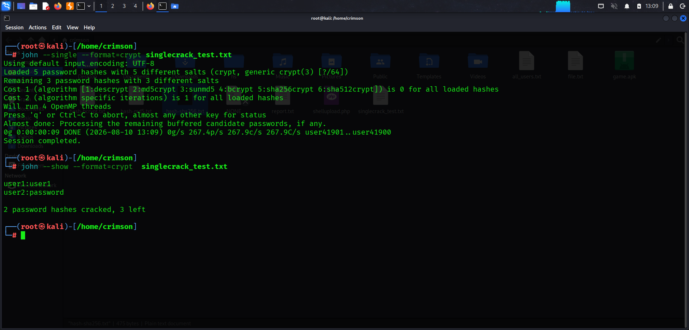

**MD5**
Generated an MD5-crypt hash for each test user's known password using openssl, since Kali's passwd command only produces yescrypt hashes for real system accounts.

```bash
john --single --format=md5crypt hash-md5.txt
```
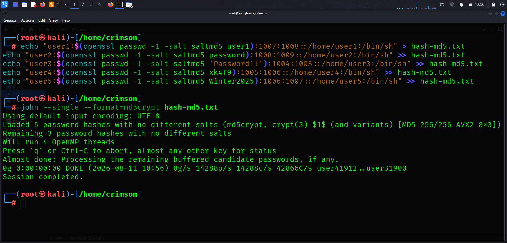

**SHA-256**

```bash
john --single --format=sha256crypt hash-sha256.txt
```
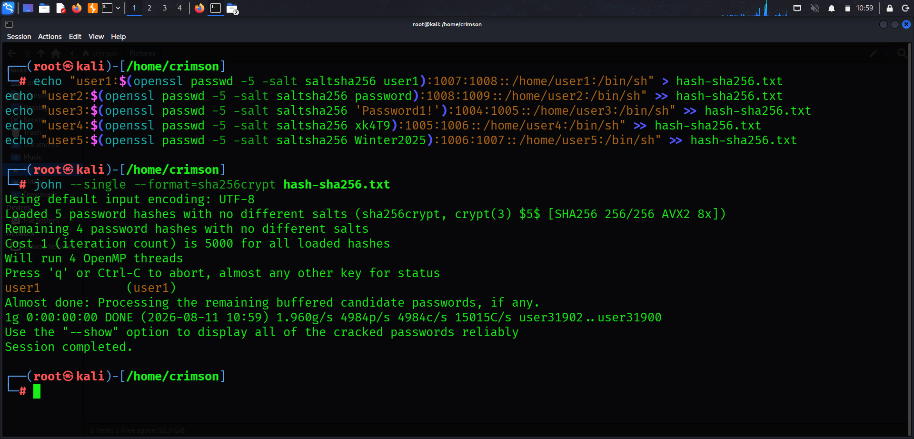

**Bcrypt**
```
john --single --format=bcrypt hash-bcrypt.txt
```
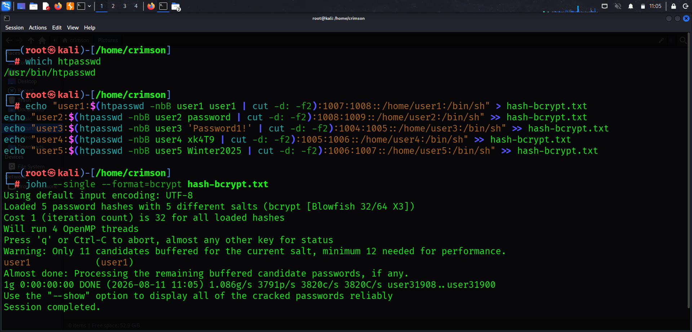

## Wordlist Mode
Executed John the Ripper using Wordlist mode, which compares each hash against passwords from a precompiled wordlist file, making it effective against passwords that are common words or previously leaked credentials.

**SHA-512crypt / yescrypt**
```bash
john --wordlist=file.txt --format=crypt singlecrack_test.txt
```
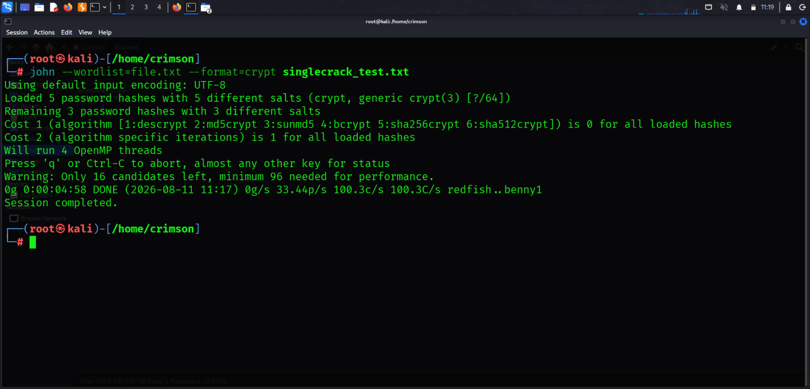

**MD5**
```bash
john --wordlist=file.txt --format=md5crypt hash-md5.txt
```
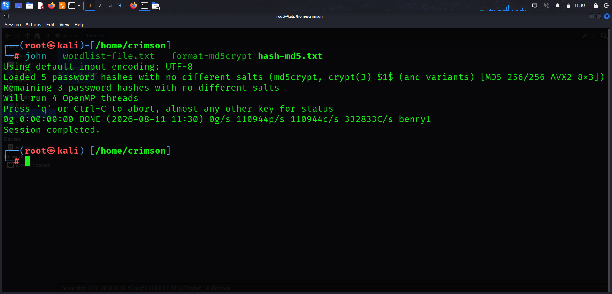

**SHA-256**
```bash
john --wordlist=file.txt --format=sha256crypt hash-sha256.txt
```
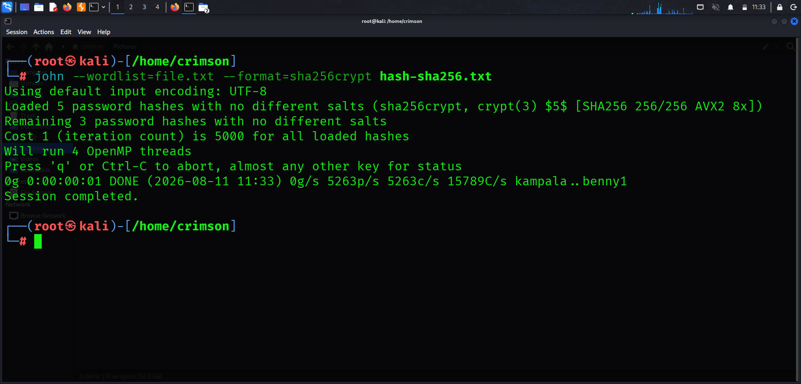

**Bcrypt**
```bash
john --wordlist=file.txt --format=bcrypt hash-bcrypt.txt
```
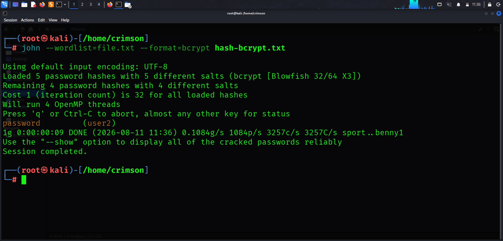


## Rules-Based Mode
Executed John the Ripper using Rules-Based mode, which applies transformation rules (such as adding numbers, capitalizing letters, or appending symbols) to wordlist entries, allowing it to crack passwords that are slight variations of common words.

**SHA-512crypt / yescrypt**
```bash
john --wordlist=file.txt --rules --format=crypt singlecrack_test.txt
```
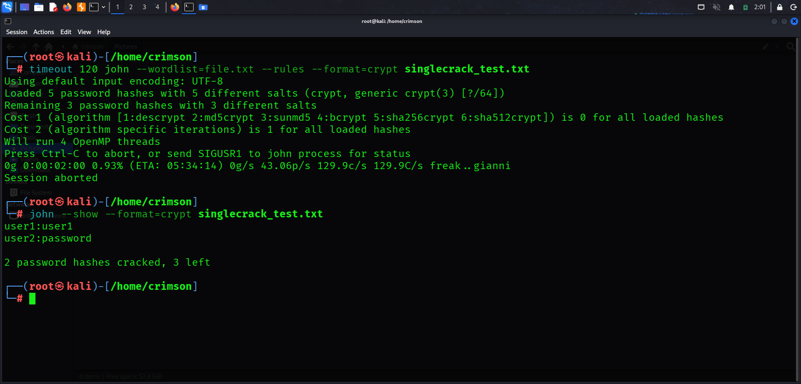

**MD5**
```bash
john --wordlist=file.txt --rules --format=md5crypt hash-md5.txt
```
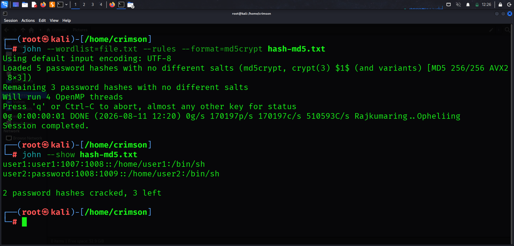

**SHA-256**
```bash
john --wordlist=file.txt --rules --format=sha256crypt hash-sha256.txt
```
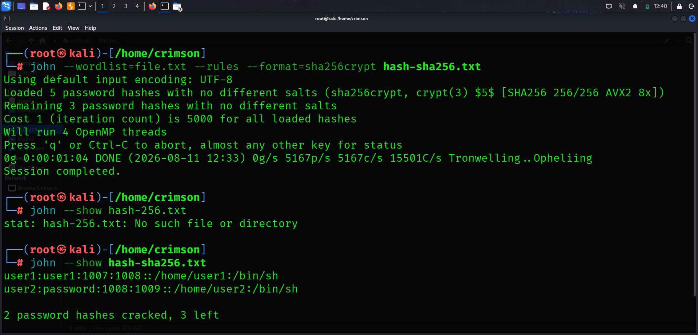

**Bcrypt**
```bash
john --wordlist=file.txt --rules --format=bcrypt hash-bcrypt.txt
```
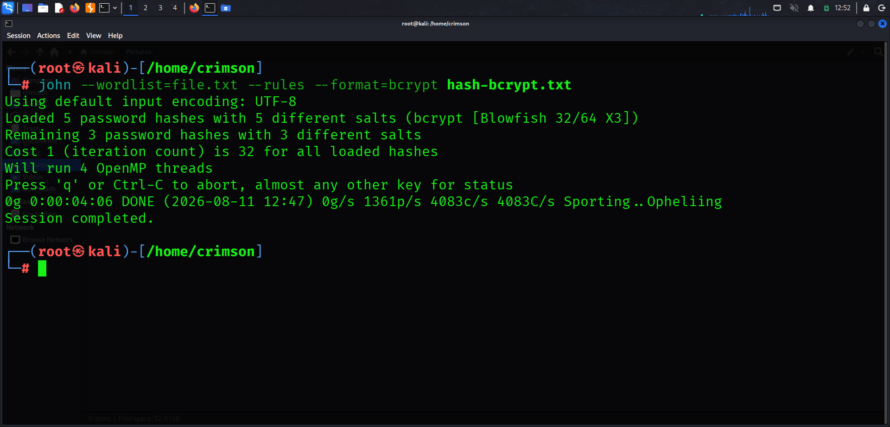


## Incremental Mode
Executed John the Ripper using Incremental mode, a brute-force attack that tries all possible character combinations. It is the most thorough but slowest mode, and its feasibility depends heavily on the strength of the hashing algorithm used.

**SHA-512crypt / yescrypt**
```bash
timeout 120 john --incremental --format=crypt singlecrack_test.txt
```
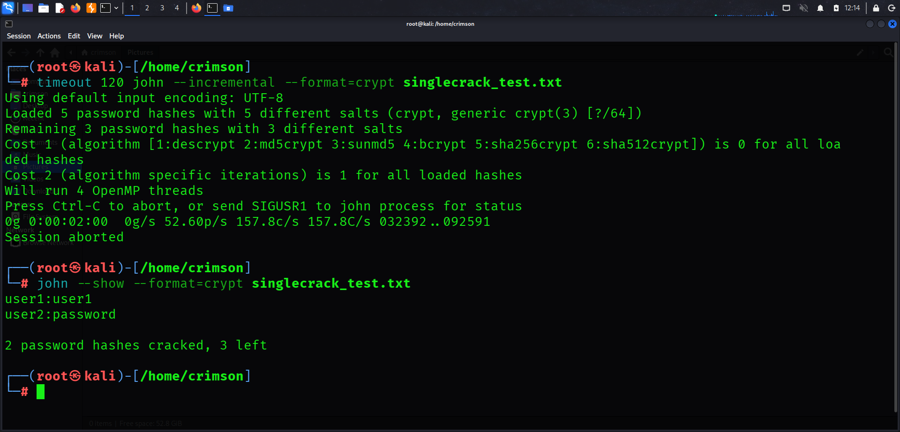
Result: Session capped at 120 seconds (~52.60 candidates/sec). No new passwords cracked within this window. 2 of 5 were previously cracked via other modes (`user1`, `password`); the remaining 3 (`Password1!`, `xk4T9`, `Winter2025`) were unreachable in the time given.

**MD5**
```bash
timeout 120 john --incremental --format=md5crypt hash-md5.txt
```
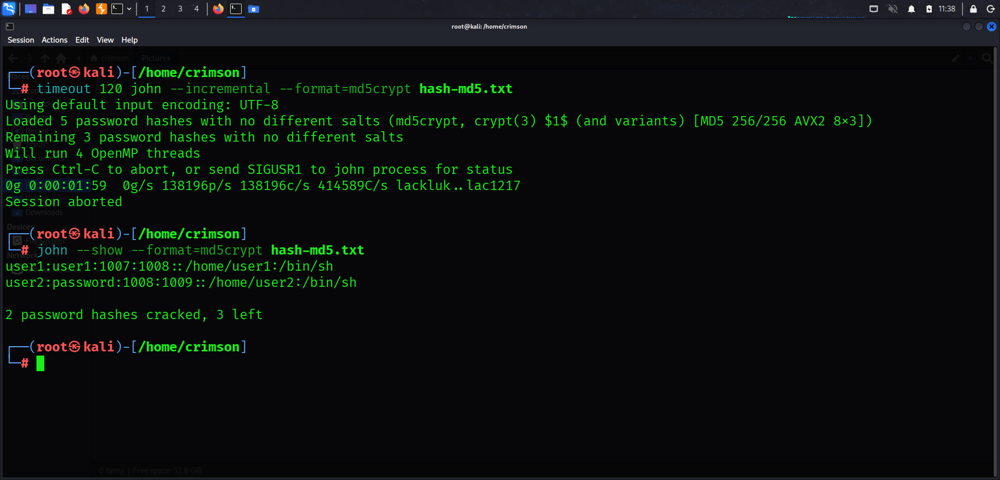
Result: Session capped at 120 seconds (~138,196 candidates/sec). No new passwords cracked within this window — the 3 remaining passwords (`Password1!`, `xk4T9`, `Winter2025`) are longer/more complex than incremental mode could reach in the time given. 2 of 5 total were previously cracked via other modes (`user1`, `password`).

**SHA-256**
```bash
timeout 220 john --incremental --format=sha256crypt hash-sha256.txt
```
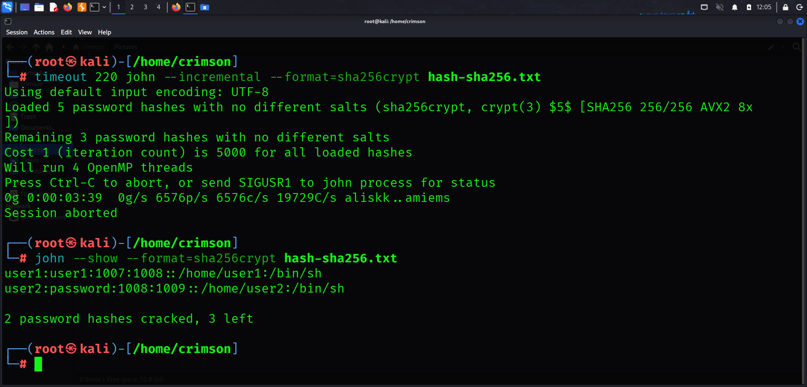
Result: Session capped at 220 seconds (~6,576 candidates/sec, 5000 iterations). No new passwords cracked within this window. 2 of 5 were previously cracked via other modes (`user1`, `password`); the remaining 3 (`Password1!`, `xk4T9`, `Winter2025`) were unreachable in the time given.

**Bcrypt**
```bash
timeout 120 john --incremental --format=bcrypt hash-bcrypt.txt
```
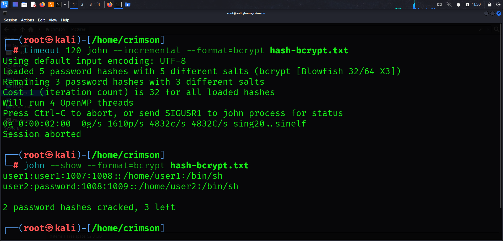
Result: Session capped at 120 seconds (~4,832 candidates/sec, cost factor 32). No new passwords cracked within this window. 2 of 5 were previously cracked via other modes (`user1`, `password`); the remaining 3 (`Password1!`, `xk4T9`, `Winter2025`) were unreachable in the time given.

## Hybrid/Mask Mode
Executed John the Ripper using Hybrid/Mask mode, which combines a wordlist with a defined character mask (appending 4 digits to each wordlist entry), targeting passwords that follow a predictable pattern such as "word + year" or "word + number".

**SHA-512crypt / yescrypt**
```bash
timeout 120 john --wordlist=file.txt --mask='?w?d?d?d?d' --format=crypt singlecrack_test.txt
```
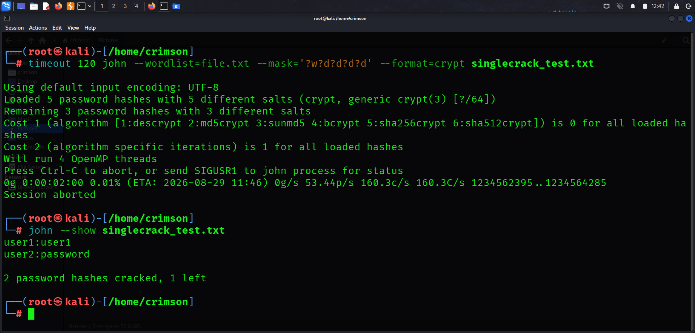
Result: Session capped at 120 seconds (~53.44 candidates/sec, 160.3 combinations/sec). No new passwords cracked within this window. 2 previously cracked via other modes (`user1`, `password`).

**MD5**
```bash
timeout 120 john --wordlist=file.txt --mask='?w?d?d?d?d' --format=md5crypt hash-md5.txt
```
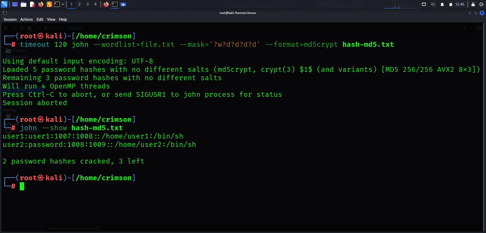

**SHA-256**
```bash
timeout 120 john --wordlist=file.txt --mask='?w?d?d?d?d' --format=sha256crypt hash-sha256.txt
```
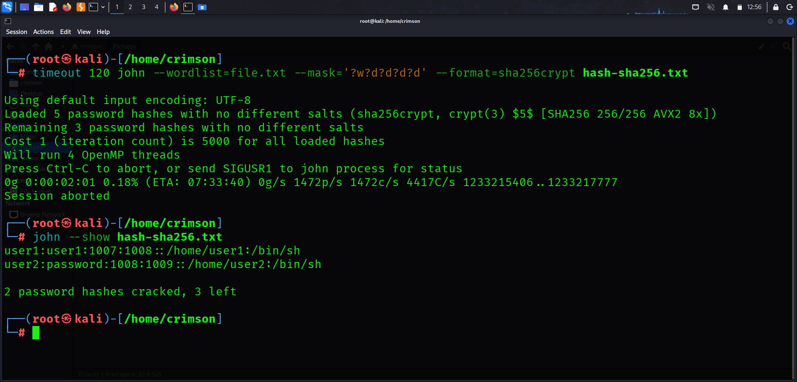
Result: Session capped at 120 seconds (~1,472 candidates/sec, 4,417 combinations/sec). No new passwords cracked within this window. 2 previously cracked via other modes (`user1`, `password`); estimated time to exhaust this mask/wordlist combination exceeded 7 hours.

**Bcrypt**
```bash
timeout 120 john --wordlist=file.txt --mask='?w?d?d?d?d' --format=bcrypt hash-bcrypt.txt
```
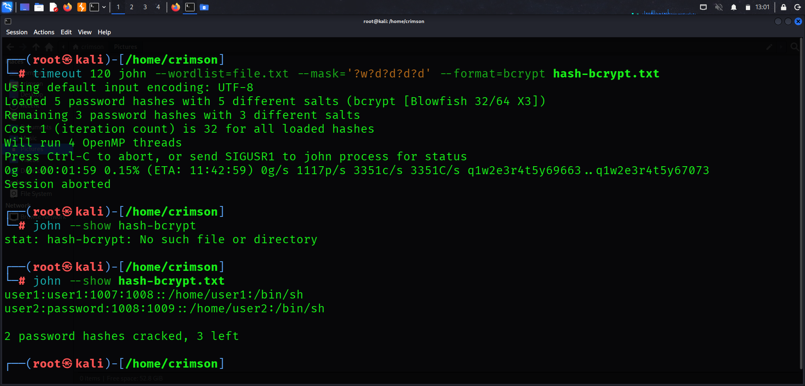
Result: Session capped at 120 seconds (~1,117 candidates/sec, 3,351 combinations/sec). No new passwords cracked within this window. 2 previously cracked via other modes (`user1`, `password`); estimated time to exhaust this mask/wordlist combination exceeded 11 hours.
