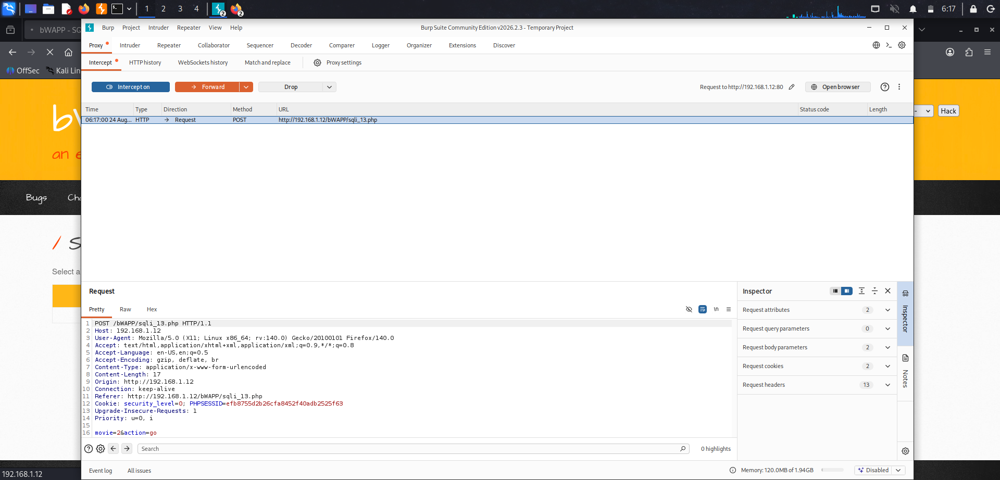
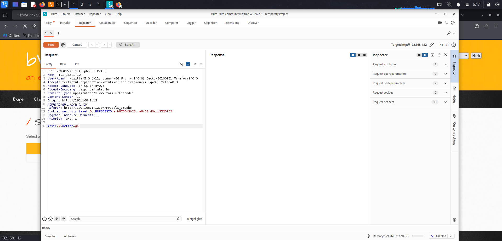
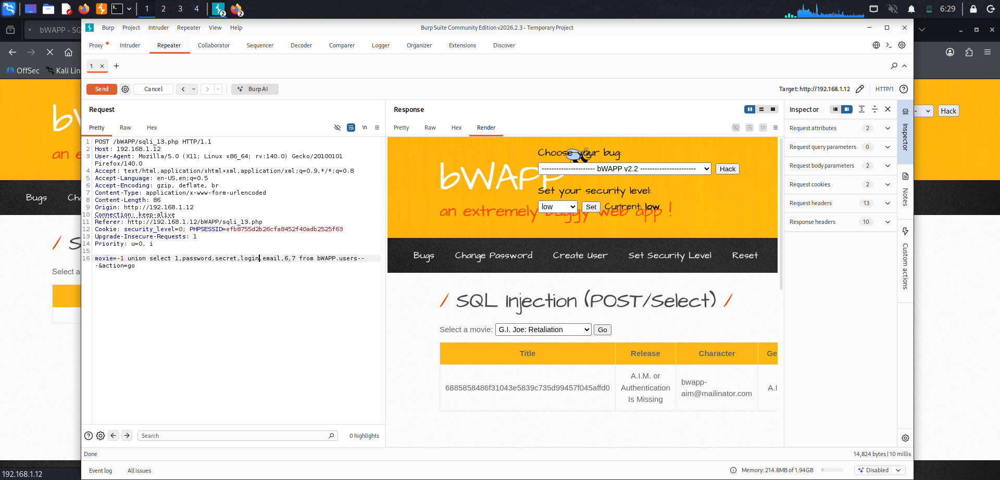

# Module: SQL Injection (POST/Select) - Low Security
Step 1: Load the module and capture the baseline request in Burp
- Set Security Level to Low
- Open SQL Injection (POST/Select) from bWAPP's menu
- With Burp running as your proxy (Proxy → Intercept), select a movie from the dropdown and click "Go"
- Burp will intercept the POST request — send it to Repeater (Ctrl+R or right-click → Send to Repeater)

Step 2: 
Check for errors

Step 3:
Extract information

