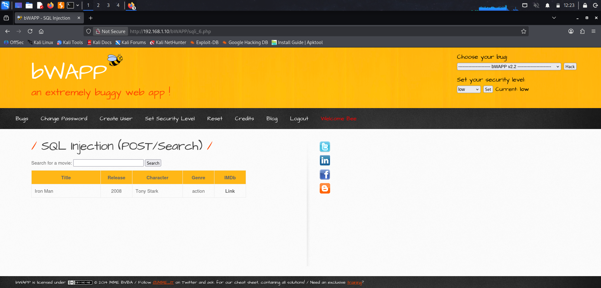
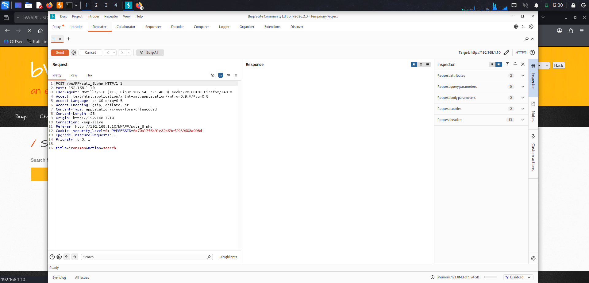
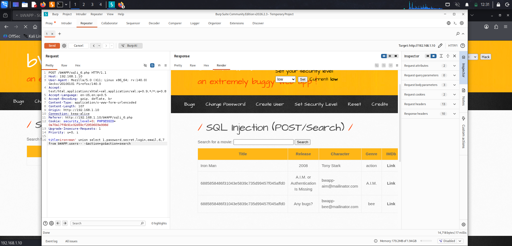

# Module: SQL Injection (POST/Search) — Low Security
Step 1: Load the module and capture baseline in Burp
Confirm Security Level is Low

Step 2:
In Burp, go to Proxy → Intercept, make sure intercept is On, then in the browser submit a normal search. Burp will grab the request — right-click it and choose Send to Repeater. Then click the Repeater tab to see it there, ready to edit and send.

Steps 3:
Extract the information

